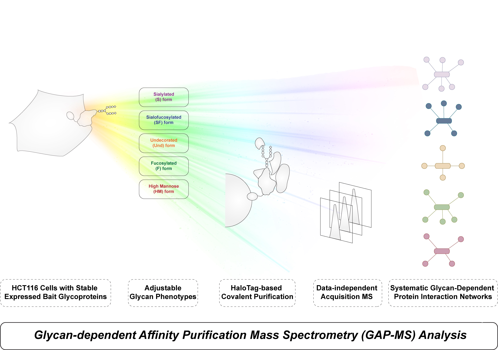

# 🧬 Glyco Interactome Network

[](https://app.netlify.com/sites/your-site-name/deploys)
[](https://www.python.org/downloads/)
[](https://streamlit.io/)
[](LICENSE)

## 📋 Abstract



Protein-protein interactions (PPIs) offer crucial insights into comprehending the complicated molecular mechanisms and signaling pathways within cells that regulate developmental processes or the progression of disease-related phenotypes. Meanwhile, proteins are frequently subject to post-translational modifications (PTMs) that enable the regulation of their functions for specific cellular events. 

One of the key challenges in studying PPIs lies in the development of methods to detect changes in interactions resulting from these PTMs. Notably, the glycosylation of cell membrane proteins to form the glycocalyx presents a considerable hurdle, as the significance of various types of glycans has largely been overlooked in most studies of membrane protein interactions. 

In this study, we introduced a novel approach termed **glycan-dependent affinity purification followed by mass spectrometry analysis (GAP-MS)** to assess variations in PPIs for any glycoprotein of interest under different glycosylation conditions. Within the framework of GAP-MS, we combine the manipulation of Glycan Phenotypes in cultured cells using a set of glycan modifier toolboxes with the classic affinity purification coupled with mass spectrometry analysis (AP-MS) approach. 

As a proof of principle, we selected four glycoproteins, namely **BSG, CD44, EGFR, and SLC3A2**, as baits to compare their co-purified partners across five distinct Glycan Phenotypes. The findings demonstrated the capability of GAP-MS in identifying PPIs that are influenced by altered glycosylation status. PPI networks based on the interactions of the aforementioned four baits were generated for each Glycan Phenotype. Moreover, the GAP-MS workflow is well-suited for systematically investigating a broader collection of glycoproteins of interest compared to studies relying on glycosite mutagenesis, thereby allowing for the expansion of these networks as more bait proteins are analyzed in future studies, which assists the development of new therapeutics targeting glycosylated proteins.

## 🚀 Features

- **Interactive Network Visualization**: Explore protein-protein interaction networks under different glycosylation conditions
- **Comparative Analysis**: Compare protein interactions across multiple glycan phenotypes
- **Protein Pair Analysis**: Detailed boxplot analysis for specific protein-protein pairs
- **Responsive Design**: Optimized for both desktop and mobile viewing
- **Real-time Data**: Integration with comprehensive GAP-MS datasets

## 🎯 Glycosylation Types

The application supports analysis of five distinct glycan phenotypes:

- **F**: Fucosylated type
- **S**: Sialylated type  
- **FS**: Sialofucosylated type
- **Neu**: Neutral type
- **HM**: High Mannose type
- **Total**: Combined analysis

## 🛠️ Technology Stack

- **Backend**: Python 3.8+, Streamlit
- **Visualization**: Pyvis, Matplotlib, NetworkX
- **Data Processing**: Pandas, NumPy
- **Frontend**: HTML5, CSS3, JavaScript
- **Deployment**: Netlify (Static), Streamlit Cloud (Application)

## 📁 Project Structure

```
Glyco_Interactome/
├── streamlit_app.py           # Main Streamlit application
├── index.html                 # Netlify landing page
├── requirements.txt           # Python dependencies
├── netlify.toml              # Netlify configuration
├── README.md                 # Project documentation
├── LICENSE                   # MIT License
├── data/                     # Data directory
│   ├── Total_html/           # Network visualization files
│   ├── boxplot_normalized/   # Normalized abundance plots
│   ├── boxplot_relative/     # Relative abundance plots
│   ├── TopS_Score/          # TopS score visualizations
│   ├── image/               # Project images
│   └── *.csv/*.xlsx         # Raw data files
└── lib/                     # Additional libraries (if any)
```

## 🔧 Local Development Setup

### Prerequisites

- Python 3.8 or higher
- pip package manager
- Git

### Installation

1. **Clone the repository**
   ```bash
   git clone https://github.com/Eva-1023/Glyco_Interactome.git
   cd Glyco_Interactome
   ```

2. **Create virtual environment** (recommended)
   ```bash
   python -m venv venv
   source venv/bin/activate  # On Windows: venv\Scripts\activate
   ```

3. **Install dependencies**
   ```bash
   pip install -r requirements.txt
   ```

4. **Run the application**
   ```bash
   streamlit run streamlit_app.py
   ```

5. **Access the application**
   Open your browser and navigate to `http://localhost:8501`

## 🌐 Deployment

### Netlify Deployment

This project is configured for easy deployment on Netlify:

1. **Fork/Clone this repository**

2. **Connect to Netlify**
   - Go to [Netlify](https://netlify.com)
   - Click "New site from Git"
   - Select your repository

3. **Configure Build Settings**
   - Build command: (leave empty)
   - Publish directory: `.` (root)
   - The `netlify.toml` file handles the configuration

4. **Deploy**
   - Netlify will automatically deploy your site
   - The main application runs on Streamlit Cloud and is embedded via iframe

### Streamlit Cloud Deployment

The Streamlit application should be separately deployed on Streamlit Cloud:

1. Go to [share.streamlit.io](https://share.streamlit.io)
2. Connect your GitHub repository
3. Set the main file path: `streamlit_app.py`
4. Deploy the application

## 📊 Data Files

The application expects the following data structure:

- `data/Total_html/`: HTML files for network visualizations
- `data/boxplot_normalized/`: PNG files for normalized abundance plots
- `data/boxplot_relative/`: PNG files for relative abundance plots  
- `data/TopS_Score/`: PNG files for TopS score visualizations
- `data/image/Abstract.jpg`: Abstract visualization image

## 🔒 Security Features

- Content Security Policy (CSP) headers
- XSS protection
- Frame options security
- Input validation and error handling
- Secure iframe embedding

## 🎨 User Interface

The application features a modern, responsive design with:

- **Navigation Sidebar**: Easy access to different sections
- **Loading States**: Smooth loading animations
- **Error Handling**: Graceful error messages and retry functionality
- **Mobile Responsive**: Optimized for all screen sizes
- **Accessibility**: Screen reader friendly with proper ARIA labels

## 📈 Usage Guide

### Network Visualization
1. Navigate to the "Network" section
2. Select your primary glycosylation condition
3. Choose a secondary condition if available
4. Explore the interactive network visualization

### Protein Pair Analysis
1. Go to "Protein-Protein Pair" section
2. Select the primary protein from the dropdown
3. Choose the secondary protein
4. View comparative analysis across different metrics

## 🤝 Contributing

We welcome contributions! Please feel free to submit a Pull Request. For major changes, please open an issue first to discuss what you would like to change.

### Development Guidelines

- Follow Python PEP 8 style guidelines
- Add docstrings to all functions
- Include type hints where appropriate
- Write descriptive commit messages
- Test your changes thoroughly

## 📄 Citation

If you use this tool or data in your research, please cite our work:

```bibtex
@article{glyco_interactome_2024,
  title={GAP-MS: A Novel Approach for Glycan-Dependent Protein-Protein Interaction Analysis},
  author={[Authors]},
  journal={[Journal]},
  year={2024},
  publisher={[Publisher]}
}
```

## 📞 Contact

- **Email**: [liy24@m.fudan.edu.cn](mailto:liy24@m.fudan.edu.cn)
- **Institution**: Greater Bay Area Institute of Precision Medicine
- **GitHub**: [@Eva-1023](https://github.com/Eva-1023)

## 📜 License

This project is licensed under the MIT License - see the [LICENSE](LICENSE) file for details.

## 🙏 Acknowledgments

- Greater Bay Area Institute of Precision Medicine
- Streamlit community for the excellent framework
- Pyvis for network visualization capabilities
- All contributors and collaborators

## 📝 Changelog

### v1.0.0 (Current)
- Initial release with core functionality
- Interactive network visualization
- Protein pair analysis
- Responsive web design
- Netlify deployment configuration

---

**Made with ❤️ for the scientific community**
